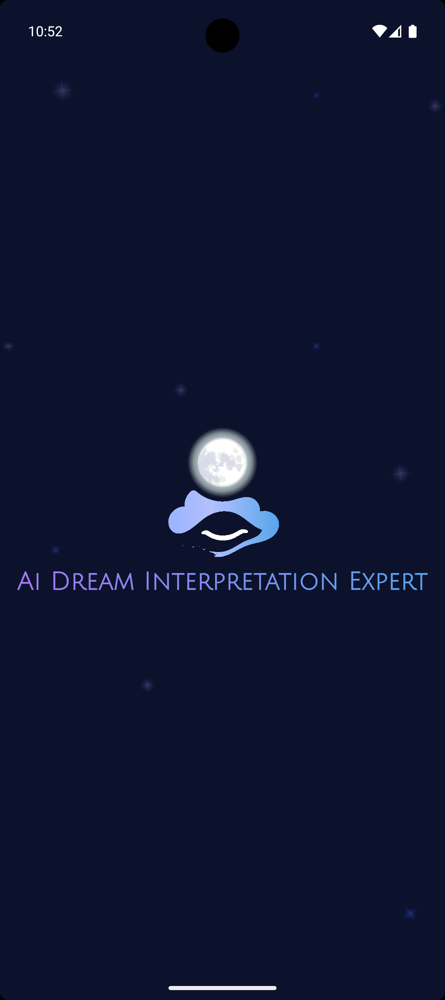
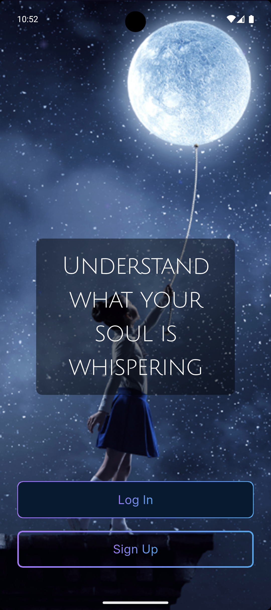
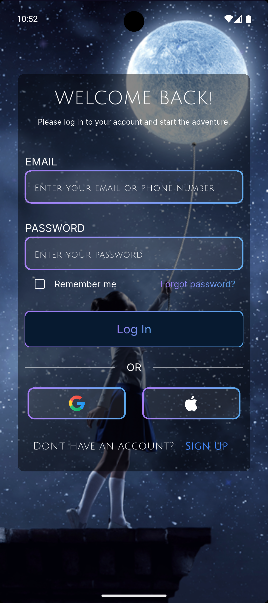

# AI Dream Interpretation

[](https://github.com/nishan979/ai_dream_interpretation) [](https://flutter.dev) [](https://github.com/nishan979/ai_dream_interpretation/blob/main/LICENSE)

A sophisticated Flutter application that interprets dreams using a custom AI-backed server. The app features robust audio playback, speech-to-text input, and a full authentication and subscription flow.

## 📸 Screenshots

<p align="center">
  
  
  
  
</p>

---

## ✨ Features

- **AI Dream Interpretation:** Send dream text to a backend server and receive detailed interpretations.
- **Interactive Follow-ups:** The AI can ask clarifying questions to provide a more accurate analysis.
- **Speech-to-Text:** Dictate dreams directly using the device's microphone.
- **Audio Playback:** Listen to interpretations as audio, supporting both streamed URLs and local Text-to-Speech (TTS).
- **Authentication:** Full sign-up, login (including Google Sign-In), and session management using Firebase Authentication.
- **Subscriptions:** Built-in subscription flow powered by **Stripe** (`flutter_stripe`).
- **Responsive Design:** Adapts to various screen sizes using `flutter_screenutil`.
- **Secure Storage:** Manages auth tokens and sensitive data using `flutter_secure_storage`.

## 🛠️ Tech Stack

- **Framework:** Flutter (Dart)
- **State Management:** GetX
- **Authentication:** `firebase_auth`, `google_sign_in`
- **Payments:** `flutter_stripe`
- **Audio/Speech:** `audioplayers`, `flutter_tts`, `speech_to_text`
- **UI:** `flutter_screenutil`
- **API Client:** `http`
- **Permissions:** `permission_handler`

---

## 🚀 Getting Started

### Prerequisites

- Flutter SDK (Stable channel)
- An editor (VS Code, Android Studio, etc.)
- Platform-specific tools (Xcode for iOS, Android SDK for Android)

Ensure your environment is set up by running:

```bash
flutter doctor
```

### Installation & Run

Clone the repository:

```bash
git clone https://github.com/nishan979/ai_dream_interpretation.git
cd ai_dream_interpretation
```

Install dependencies:

```bash
flutter pub get
```

Run the app (choose the device/emulator first):

```bash
flutter run
```

### ⚙️ Configuration

This application requires a custom backend server to handle AI processing, authentication, and audio generation.

Open the environment configuration file at `lib/constants.dart` and set the `baseUrl` constant to point to your backend's URL.

For local testing with the Android Emulator: use `http://10.0.2.2:PORT`.

For local testing with the iOS Simulator: use `http://localhost:PORT`.

The client sends auth tokens as `Authorization: Bearer <token>` headers for protected endpoints.

## 📦 Building for Production

Android (APK):

```bash
flutter build apk --release
```

Android (App Bundle):

```bash
flutter build appbundle --release
```

iOS (Archive):

```bash
flutter build ios --release
```

Web:

```bash
flutter build web
```

---

## 🧪 Testing & Analysis

Run widget tests:

```bash
flutter test
```

Run static code analyzer:

```bash
flutter analyze
```

Format all Dart files:

```bash
flutter format .
```

---

## 🤝 Contributing

Contributions are welcome! If you find a bug or want to suggest a new feature, please open an issue or submit a pull request.

Typical workflow:

1. Fork the repository
2. Create your feature branch
3. Commit your changes
4. Push and open a Pull Request

---

## 📄 License

This project is licensed under the MIT License. See the `LICENSE` file for details.

---

If you'd like, I can also:

- Add `assets/ss/` to `pubspec.yaml` and create a PR.
- Insert small non-comment no-op exception handlers to silence `empty_catches` analyzer warnings.
- Migrate deprecated `speech_to_text` usages to the newer `SpeechListenOptions` API.

Tell me which of those you'd like me to do next and I'll prepare a PR.
